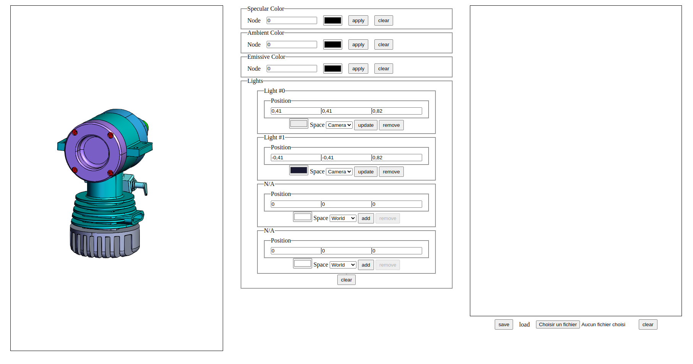

## HOOPS Communicator Command Interpreter

## Introduction

The command Interpreter add-on is a little library that allow users to save the
scenario of edition they do on a scene in order to replay and share them.

The interpreter will be used as a gateway to the edition APIs.

> Basically users will issue the command to the interpreter instead of applying
> them on the viewer components.  
> For example
>
> ```ts
> const hwv = new Communicator.WebViewer({
>   /* ... */
> });
>
> // In order to simplify interpreter tuning we recommend using a builder more
> // on that later.
> const cmd = new Interpreter(/* ... */);
>
> /* ... */
>
> // instead of calling a given API on viewer component
> hwv.model.setNodesFaceColor(/* ... */);
>
> // you call the API through the interpreter
> cmd.play("setNodesFaceColor", {
>   /* ... */
> });
> ```

## Build and try

This project contains both the _Command Interpreter_ library and
a sample application to demo it (see Tutorial part below).

You can run some command on the project to build the library or the
application, but you can also run a development server to get live
feedback if you want to customize the sample.

```bash
# Build the library for production
npm run build

# Build the library for development (non-minified)
npm run build-dev

# Build the sample application
npm run build-app
```

## Tutorial

In this tutorial we will produce this simple demo application:


Every change that we will do to the scene through the UI will be save in the
interpreter history and we will be able to export the history and import it.

> This application will be made in HTML, CSS and Typescript (no framework).
> The application has been made using _vite_ CLI so it can be installed and run
> with the following commands in a terminal:
>
> ```bash
> # inside the repository
> # install the dependencies
> npm install
>
> # run development app
> npm run dev
> ```
>
> You can pick any stack or tool you want this document will try to be the
> most technology agnostic possible.

To start we've create a HTML file with all our UI and a CSS style to display
them correctly on screen.

- [./index.html](index.html)
- [./src/style.css](src/style.css)

We also created a [src/app/common.ts](src/app/common.ts) where we have added
this helper function:

```ts
export function getElementById<T extends HTMLElement>(id: string): T {
  const elm = document.getElementById(id) as T | null;

  if (!elm) {
    throw new Error(`missing dom element '${id}'`);
  }

  return elm;
}
```

We have a lot of inputs to deal with, let break it down to smaller targets.
We will use:

- A controller for the phong colors
- A controller for each light slot
- A controller to manage the rest of the page

Let's start by grabbing all the HTML input elements that we need to track.
For example:

```ts
// src/app/controllers/PhongController

export default class PhongController {
  public readonly specularNodeIdElm: HTMLInputElement;
  public readonly specularColorElm: HTMLInputElement;
  public readonly specularApplyBtn: HTMLButtonElement;
  public readonly specularClearBtn: HTMLButtonElement;

  public readonly ambientNodeIdElm: HTMLInputElement;
  public readonly ambientColorElm: HTMLInputElement;
  public readonly ambientApplyBtn: HTMLButtonElement;
  public readonly ambientClearBtn: HTMLButtonElement;

  public readonly emissiveNodeIdElm: HTMLInputElement;
  public readonly emissiveColorElm: HTMLInputElement;
  public readonly emissiveApplyBtn: HTMLButtonElement;
  public readonly emissiveClearBtn: HTMLButtonElement;

  constructor() {
    this.specularNodeIdElm = getElementById<HTMLInputElement>(`specular-node`);
    this.specularColorElm = getElementById<HTMLInputElement>(`specular-color`);
    this.specularApplyBtn = getElementById<HTMLButtonElement>(`specular-apply`);
    this.specularClearBtn = getElementById<HTMLButtonElement>(`specular-clear`);

    this.ambientNodeIdElm = getElementById<HTMLInputElement>(`ambient-node`);
    this.ambientColorElm = getElementById<HTMLInputElement>(`ambient-color`);
    this.ambientApplyBtn = getElementById<HTMLButtonElement>(`ambient-apply`);
    this.ambientClearBtn = getElementById<HTMLButtonElement>(`ambient-clear`);

    this.emissiveNodeIdElm = getElementById<HTMLInputElement>(`emissive-node`);
    this.emissiveColorElm = getElementById<HTMLInputElement>(`emissive-color`);
    this.emissiveApplyBtn = getElementById<HTMLButtonElement>(`emissive-apply`);
    this.emissiveClearBtn = getElementById<HTMLButtonElement>(`emissive-clear`);
  }

  /* ... */
}
```

Then we do the same with the two other controllers.

Now in our [src/main.ts](src/main.ts) file let's instantiate these controllers.

```ts
import LightController from "./app/controllers/LightController";
import PhongController from "./app/controllers/PhongController";
import PageController from "./app/controllers/PageController";

const page = new PageController();
const phong = new PhongController(page.cmd);

const lights = [
  new LightController(0, page.cmd),
  new LightController(1, page.cmd),
  new LightController(2, page.cmd),
  new LightController(3, page.cmd),
];
```

In the [PageController](src/app/controllers/PageController.ts) we have
instantiated the WebViewer and the Interpreter:

```ts
export default class PageController {
  /* ... */

  public readonly hwv: Communicator.WebViewer;
  public readonly cmd: Interpreter;

  constructor() {
    /* ... */

    this.hwv = new Communicator.WebViewer({
      container: this.viewerContainerElm,
      endpointUri: "models/microengine.scs",
    });

    this.cmd = CmdBuilder.buildInterpreter(
      CmdBuilder.buildEnv({
        hwv: this.hwv,
      })
    );
  }
}
```

In the rest of [src/main.ts](src/main.ts) we will write some utility code to
bind events on the DOM with our controllers:

```ts

/* ... */

page.hwv.setCallbacks({
  modelStructureReady: () => {
    refreshLights();
    for (let i = 0; i < 4; ++i) {
      lights[i].updateElm.addEventListener("click", () => {
        handleLightUpdate(lights[i]);
      });

      lights[i].removeElm.addEventListener("click", () => {
        handleLightRemoved(lights[i]);
      });
    }

    page.clearLightsBtn.addEventListener("click", () => {
      page.cmd.play("clearLights").then(() => refreshLights());
    });

    phong.specularApplyBtn.addEventListener("click", () => {
      handleSpecularColorApply();
    });

    phong.specularClearBtn.addEventListener("click", () => {
      handleSpecularColorClear();
    });

    /* ... */
});

/* ... */
```

> The `refreshLights` function updates the lights UI. You can read
> [src/main.ts](src/main.ts) if you want to see the implementation details.

As you can see in the sample, you can play a command through the command
interpreter passing the command arguments:

```ts
// Command with no arguments
page.cmd.play("clearLights");

// Command with arguments
page.cmd.play("setNodesAmbientColor", {
  nodeIds: [nodeId],
  color: Communicator.Color.red(),
});
```

We can also manipulate the history as you can see in
[src/app/controllers/PageController.ts](src/app/controllers/PageController.ts):

```ts
export default class PageController {
  /* ... */

  public readonly hwv: Communicator.WebViewer;
  public readonly cmd: Interpreter;

  constructor() {
    /* ... */
  }

  /* ... */

  async saveHistory() {
    this.cmd.export("history.json");
  }

  async loadHistory(file: File) {
    return this.cmd.import(file);
  }

  clearHistory() {
    this.cmd.history.clear();
    /* ... */
  }
}
```

## Extending the Interpreter

In this section we will explain step by step how you can extend the interpreter
from adding actions to customize serialization or import and export.

### Adding commands

Let's see a couple of commands:

```ts
// This is all you need to create a command without argument.
export const resetCameraCmd: Command = {
  name: "resetCamera",
  execute: async (args: unknown, env: CommandEnv) => {
    return env.hwv.view.resetCamera();
  },
};

// Here is an example with an object as argument.
export const SetNodeFaceColorCmd: Command = {
  name: "setNodeFaceColor",
  execute: async (args: unknown, env: CommandEnv) => {
    const { r, g, b } = args.color;

    return env.hwv.model.setNodeFaceColor(
      args.node,
      args.face,
      new Communicator.Color(r, g, b)
    );
  },
};

// Another example with an array as argument.
export const unsetNodesFaceColorCmd: Command = {
  name: "unsetNodesFaceColor",
  execute: async (args: unknown, env: CommandEnv) => {
    return env.hwv.model.unsetNodesFaceColor(args);
  },
};
```

> As the args can be extracted from an external source it can be useful to do
> some schema validation onto it, some test can be performed on arguments to check
> that it matches the expected type.  
> More on that later.

Now let's add the commands to our interpreter:

```ts
const cmd = new Interpreter({
  /* ... */
});
cmd.addCommands(resetCameraCmd, SetNodeFaceColorCmd, unsetNodesFaceColorCmd);
// You can also add commands one by one
cmd.addCommands(resetCameraCmd);

// You can chain the operations
cmd.addCommands(SetNodeFaceColorCmd).addCommands(unsetNodesFaceColorCmd);

// or use spread operator on an array
cmd.addCommands(
  ...[
    /* commands */
  ]
);
```

now you can call the command from the Interpreter:

```ts
cmd.play("resetCamera");
```

### Our first Command

A Command is an object that must contain a `name` property and an `execute`
function.  
Additionally, a command can contain a `serialize` function and a `parse`
function.

Let's create a command and improve it step by step.

```ts
// Here is an example with an object as argument.
export const setNodeRgbaColorCmd: Command = {
  name: "setNodeRgbaColor",
  execute: async (args: unknown, env: CommandEnv) => {
    const { r, g, b, a } = args.color;

    await this.hwv.model.setNodesFaceColor(
      args.nodes,
      new Communicator.Color(r, g, b)
    );
    await this.hwv.model.setNodesOpacity([args.nodes], a);
  },
};
```

This simple command sets the color and the opacity of some nodes.

We may want to check that the args matches with the expected type:

```ts
// Here is an example with an object as argument.
export const setNodeRgbaColorCmd: Command = {
  name: "setNodeRgbaColor",
  execute: async (args: unknown, env: CommandEnv) => {
    if (!args.color || !args.nodes) {
      throw new Error("args does not match expected type");
    }

    if (!args.color["r"] || !args.color["g"] || !args.color["b"]) {
      throw new Error("args does not match expected type");
    }

    if (!Array.isArray(args.nodes) || !args.nodes.length) {
      throw new Error("args does not match expected type");
    }

    /* ... */

    const { r, g, b, a } = args.color;

    await this.hwv.model.setNodesFaceColor(
      args.nodes,
      new Communicator.Color(r, g, b)
    );
    await this.hwv.model.setNodesOpacity(args.nodes, a);
  },
};
```
