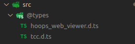

## HOOPS Communicator Command Interpreter

## Introduction

The command Interpreter add-on is a little library that allow users to save the
scenario of edition they do on a scene in order to replay and share them.

The interpreter will be used as a gateway to the edition APIs.

> Basically users will issue the command to the interpreter instead of applying
> them on the viewer components.  
> For example
>
> ```ts
> const hwv = new Communicator.WebViewer({
>   /* ... */
> });
>
> // In order to simplify interpreter tuning we recommend using a builder more
> // on that later.
> const cmd = new Interpreter(/* ... */);
>
> /* ... */
>
> // instead of calling a given API on viewer component
> hwv.model.setNodesFaceColor(/* ... */);
>
> // you call the API through the interpreter
> cmd.play("setNodesFaceColor", {
>   /* ... */
> });
> ```

## Build and try

### Preamble

Before doing anything on this project you will need to add a few asset files:  


In `public/models` add `microengine.scs`.  
In `public/scripts` add

- `engine.wasm`
- `engine-wasm.js`
- `hoops_web_viewer.js`

You will also need to add the type declaration files into `src/@types`:  


In `src/@types` add `tcc.d.ts` and `hoops_web_viewer.d.ts`.

This project contains both the _Command Interpreter_ library and
a sample application to demo it (see Tutorial part below).

You can run some command on the project to build the library or the
application, but you can also run a development server to get live
feedback if you want to customize the sample.

### Quick Start

```bash
# Build the library for production
npm run build

# Build the library for development (non-minified)
npm run build-dev

# Build the sample application
npm run build-app
```

## Tutorial

In this tutorial we will produce this simple demo application:


Every change that we will do to the scene through the UI will be save in the
interpreter history and we will be able to export the history and import it.

> This application will be made in HTML, CSS and Typescript (no framework).
> The application has been made using _vite_ CLI so it can be installed and run
> with the following commands in a terminal:
>
> ```bash
> # inside the repository
> # install the dependencies
> npm install
>
> # run development app
> npm run dev
> ```
>
> You can pick any stack or tool you want this document will try to be the
> most technology agnostic possible.

To start we've create a HTML file with all our UI and a CSS style to display
them correctly on screen.

- [./index.html](index.html)
- [./src/style.css](src/style.css)

We also created a [src/app/common.ts](src/app/common.ts) where we have added
this helper function:

```ts
export function getElementById<T extends HTMLElement>(id: string): T {
  const elm = document.getElementById(id) as T | null;

  if (!elm) {
    throw new Error(`missing dom element '${id}'`);
  }

  return elm;
}
```

We have a lot of inputs to deal with, let break it down to smaller targets.
We will use:

- A controller for the phong colors
- A controller for each light slot
- A controller to manage the rest of the page

Let's start by grabbing all the HTML input elements that we need to track.
For example:

```ts
// src/app/controllers/PhongController

export default class PhongController {
  public readonly cmd: Interpreter;
  public readonly specularNodeIdElm: HTMLInputElement;
  public readonly specularColorElm: HTMLInputElement;
  public readonly specularApplyBtn: HTMLButtonElement;
  public readonly specularClearBtn: HTMLButtonElement;

  public readonly ambientNodeIdElm: HTMLInputElement;
  public readonly ambientColorElm: HTMLInputElement;
  public readonly ambientApplyBtn: HTMLButtonElement;
  public readonly ambientClearBtn: HTMLButtonElement;

  public readonly emissiveNodeIdElm: HTMLInputElement;
  public readonly emissiveColorElm: HTMLInputElement;
  public readonly emissiveApplyBtn: HTMLButtonElement;
  public readonly emissiveClearBtn: HTMLButtonElement;

  constructor(cmd: Interpreter) {
    this.cmd = cmd;
    this.specularNodeIdElm = getElementById<HTMLInputElement>(`specular-node`);
    this.specularColorElm = getElementById<HTMLInputElement>(`specular-color`);
    this.specularApplyBtn = getElementById<HTMLButtonElement>(`specular-apply`);
    this.specularClearBtn = getElementById<HTMLButtonElement>(`specular-clear`);

    this.ambientNodeIdElm = getElementById<HTMLInputElement>(`ambient-node`);
    this.ambientColorElm = getElementById<HTMLInputElement>(`ambient-color`);
    this.ambientApplyBtn = getElementById<HTMLButtonElement>(`ambient-apply`);
    this.ambientClearBtn = getElementById<HTMLButtonElement>(`ambient-clear`);

    this.emissiveNodeIdElm = getElementById<HTMLInputElement>(`emissive-node`);
    this.emissiveColorElm = getElementById<HTMLInputElement>(`emissive-color`);
    this.emissiveApplyBtn = getElementById<HTMLButtonElement>(`emissive-apply`);
    this.emissiveClearBtn = getElementById<HTMLButtonElement>(`emissive-clear`);
  }

  /* ... */
}
```

Then we do the same with the two other controllers.

Now in our [src/main.ts](src/main.ts) file let's instantiate these controllers.

```ts
import LightController from "./app/controllers/LightController";
import PhongController from "./app/controllers/PhongController";
import PageController from "./app/controllers/PageController";

const page = new PageController();
const phong = new PhongController(page.cmd);

const lights = [
  new LightController(0, page.cmd),
  new LightController(1, page.cmd),
  new LightController(2, page.cmd),
  new LightController(3, page.cmd),
];
```

In the [PageController](src/app/controllers/PageController.ts) we have
instantiated the WebViewer and the Interpreter:

```ts
export default class PageController {
  /* ... */

  public readonly hwv: Communicator.WebViewer;
  public readonly cmd: Interpreter;

  constructor() {
    /* ... */

    this.hwv = new Communicator.WebViewer({
      container: this.viewerContainerElm,
      endpointUri: "models/microengine.scs",
    });

    this.cmd = CmdBuilder.buildInterpreter(
      CmdBuilder.buildEnv({
        hwv: this.hwv,
      })
    );
  }
}
```

In the rest of [src/main.ts](src/main.ts) we will write some utility code to
bind events on the DOM with our controllers:

```ts

/* ... */

page.hwv.setCallbacks({
  modelStructureReady: () => {
    refreshLights();
    for (let i = 0; i < 4; ++i) {
      lights[i].updateElm.addEventListener("click", () => {
        handleLightUpdate(lights[i]);
      });

      lights[i].removeElm.addEventListener("click", () => {
        handleLightRemoved(lights[i]);
      });
    }

    page.clearLightsBtn.addEventListener("click", () => {
      page.cmd.play("clearLights").then(() => refreshLights());
    });

    phong.specularApplyBtn.addEventListener("click", () => {
      handleSpecularColorApply();
    });

    phong.specularClearBtn.addEventListener("click", () => {
      handleSpecularColorClear();
    });

    /* ... */
});

/* ... */
```

> The `refreshLights` function updates the lights UI. You can read
> [src/main.ts](src/main.ts) if you want to see the implementation details.

As you can see in the sample, you can play a command through the command
interpreter passing the command arguments:

```ts
// Command with no arguments
page.cmd.play("clearLights");

// Command with arguments
page.cmd.play("setNodesAmbientColor", {
  nodeIds: [nodeId],
  color: Communicator.Color.red(),
});
```

We can also manipulate the history as you can see in
[src/app/controllers/PageController.ts](src/app/controllers/PageController.ts):

```ts
export default class PageController {
  /* ... */

  public readonly hwv: Communicator.WebViewer;
  public readonly cmd: Interpreter;

  constructor() {
    /* ... */
  }

  /* ... */

  async saveHistory() {
    this.cmd.export("history.json");
  }

  async loadHistory(file: File) {
    return this.cmd.import(file);
  }

  clearHistory() {
    this.cmd.history.clear();
    /* ... */
  }
}
```

## Extending the Interpreter

In this section we will explain step by step how you can extend the interpreter
from adding actions to customize serialization or import and export.

### Adding commands

Let's see a couple of commands:

```ts
// This is all you need to create a command without argument.
export const resetCameraCmd: Command = {
  name: "resetCamera",
  execute: async (args: unknown, env: CommandEnv) => {
    return env.hwv.view.resetCamera();
  },
};

// Here is an example with an object as argument.
export const setNodeFaceColorCmd: Command = {
  name: "setNodeFaceColor",
  execute: async (args: unknown, env: CommandEnv) => {
    const { r, g, b } = args.color;

    return env.hwv.model.setNodeFaceColor(
      args.node,
      args.face,
      new Communicator.Color(r, g, b)
    );
  },
};

// Another example with an array as argument.
export const unsetNodesFaceColorCmd: Command = {
  name: "unsetNodesFaceColor",
  execute: async (args: unknown, env: CommandEnv) => {
    return env.hwv.model.unsetNodesFaceColor(args);
  },
};
```

> As the args can be extracted from an external source it can be useful to do
> some schema validation onto it, some test can be performed on arguments to check
> that it matches the expected type.  
> More on that later.

Now let's add the commands to our interpreter:

```ts
const cmd = new Interpreter({
  /* ... */
});
cmd.addCommands(resetCameraCmd, setNodeFaceColorCmd, unsetNodesFaceColorCmd);
// You can also add commands one by one
cmd.addCommands(resetCameraCmd);

// You can chain the operations
cmd.addCommands(setNodeFaceColorCmd).addCommands(unsetNodesFaceColorCmd);

// or use spread operator on an array
cmd.addCommands(
  ...[
    /* commands */
  ]
);
```

now you can call the command from the Interpreter:

```ts
cmd.play("resetCamera");
```

### Our first Command

A Command is an object that must contain a `name` property and an `execute`
function.  
Additionally, a command can contain a `serialize` function and a `parse`
function.

Let's create a command and improve it step by step.

```ts
export const setNodeRgbaColorCmd: Command = {
  name: "setNodeRgbaColor",
  execute: async (args: unknown, env: CommandEnv) => {
    const { r, g, b, a } = args.color;

    await this.hwv.model.setNodesFaceColor(
      args.nodes,
      new Communicator.Color(r, g, b)
    );
    await this.hwv.model.setNodesOpacity([args.nodes], a);
  },
};

/* ... */

cmd.addCommands(setNodeRgbaColorCmd);
```

This simple command sets the color and the opacity of some nodes.

We may want to check that the args matches with the expected type:

```ts
export const setNodeRgbaColorCmd: Command = {
  name: "setNodeRgbaColor",
  execute: async (args: unknown, env: CommandEnv) => {
    if (!args.color || !args.nodes) {
      throw new Error("args does not match expected type");
    }

    if (!args.color["r"] || !args.color["g"] || !args.color["b"]) {
      throw new Error("args does not match expected type");
    }

    if (!Array.isArray(args.nodes) || !args.nodes.length) {
      throw new Error("args does not match expected type");
    }

    /* ... */

    const { r, g, b, a } = args.color;

    await this.hwv.model.setNodesFaceColor(
      args.nodes,
      new Communicator.Color(r, g, b)
    );
    await this.hwv.model.setNodesOpacity(args.nodes, a);
  },
};
```

### Serialization

By default the arguments of a command are not serializable/parsable (except if
you use a **Builder** more on that later).

If you want to make your command serializable arguments and parsable you can add
callbacks to your object:

```ts
export const setNodeRgbaColorCmd: Command = {
  name: "setNodeRgbaColor",
  execute: async (args: unknown, env: CommandEnv) => {
    /* ... */
  },
  serialize: async (args: unknown): Promise<string> => {
    return JSON.stringify(args);
  },
  parse: async (str: string): Promise<unknown> => {
    return JSON.parse(str);
  },
};
```

Now our command can be serialize into a string and exported into a
file or a storage system. I can also be imported from a file or a
storage system.

There are several ways to improve this code, first we know we should never trust the input data so we could make some tests on
the json data we parse.

```ts
export const setNodeRgbaColorCmd: Command = {
  name: "setNodeRgbaColor",
  /* ... */
  parse: async (str: string): Promise<unknown> => {
    const obj = JSON.parse(str);
    if (
      typeof obj.r !== "number" ||
      typeof obj.g !== "number" ||
      typeof obj.b !== "number" ||
      typeof obj.a !== "number"
    ) {
      throw new Error(`Cannot parse rgba color, received: '${str}'`);
    }
  },
};
```

We may also argue that storing the color as a #RRGGBBAA string
would be more data efficient.
Let's try it

```ts
// This function will convert a Color into a #RRGGBBAA string
function colorToHex(rgba: Color): string {
  /* ... */
}

// This function will convert a #RRGGBBAA string into a Color
// or throw an Error if the string can't be parsed.
function hexToColor(hex: string): Color {
  /* ... */
}

export const setNodeRgbaColorCmd: Command = {
  name: "setNodeRgbaColor",
  execute: async (args: unknown, env: CommandEnv) => {
    /* ... */
  },
  serialize: async (args: unknown): Promise<string> => {
    return colorToHex(args as Color);
  },
  parse: async (str: string): Promise<unknown> => {
    return hexToColor(str);
  },
};
```

## Tuning the Interpreter

The Interpreter component itself is made out of several components:

```ts
export class Interpreter {
  public env: CommandEnv;

  public readonly history: IHistory;
  public readonly serializer: ISerializer;
  public readonly saver: ISaver;

  /* ... */

  constructor(props: {
    env: CommandEnv;
    history: IHistory;
    serializer: ISerializer;
    saver: ISaver;
    commandMap?: Map<string, Command>;
  }) {
    /* ... */
  }
}
```

### The Command Environment

The **Command Environment** is the "_global variables_" of your commands. It will be passed to the command alongside the arguments.  
it can
contain anything you want to share it must match this this type:

```ts
/**
 * Default environment for commands' runtime
 */
export interface CommandEnv {
  hwv: Communicator.WebViewer;
  confSerializer: (env: CommandEnv) => Promise<string>;
  confParser: (env: CommandEnv, str: string) => Promise<void>;
}
```

It should contain at least the **WebViewer**, a confSerializer and a
confParser, you can use it to check compatibility of versions or save parameters
in the env depending on your use case.

### The History

The History component is responsible for holding the latest commands the user have played.

It can be any anything that implements this interface:

```ts
/**
 * This interface represents a command history in the interpreter
 */
export interface IHistory {
  add: (...records: CommandRecord[]) => this;
  clear: () => this;
  records: CommandRecord[];
}

/**
 * This type represents a command recorded in the history
 */
export type CommandRecord = {
  command: string;
  args: string;
};
```

A CommandRecord is an object that has the name of a command as `command` and a string representing the serialized arguments as `args`.

A default implementation of the History is available is [src/lib/commands/History.ts](src/lib/commands/History.ts).
You can create your own history or extend the default one to limit the number of record or make some optimizations.

### The Serializer

The serializer component will serialize your environment configuration and your history's records into a string and parse a string to extract your configuration and an array of records.

It can be any anything that implements this interface:

```ts
/**
 * This interface represents the serialization system used by the interpreter
 */
export interface ISerializer {
  serialize: (env: CommandEnv, records: CommandRecord[]) => Promise<string>;
  parse: (env: CommandEnv, log: string) => Promise<CommandRecord[]>;
}
```

A default implementation of the History is available is [src/lib/commands/Serializer.ts](src/lib/commands/History.ts).

The default Serializer uses JSON and produce a file that follows this structure:

```json
{
  "config": /* your config */,
  "history": [/* your records */],
}
```

> Note: It will use the `env.confSerializer` and `env.confParser` internally

You can create your own serializer or extend the default one to improve type checking, change the the output format, make it xml, yaml, binary or make any optimization or customization you need.

### The Saver

Finally the last component, the saver. The Saver is the system responsible for persisting the data.
It can be anything that implements this interface:

```ts
/**
 * This interface represents the persistence system used by the interpreter
 */
export interface ISaver {
  export: (destination: unknown, log: string) => Promise<void>;
  import: (source: unknown) => Promise<string>;
}
```

There are several example implementation of this component in [src/lib/commands/Saver.ts](src/lib/commands/Saver.ts):

```ts
// An example persisting in local storage
export class LocalSaver implements ISaver {
  async export(destination: unknown, log: string): Promise<void> {
    localStorage.setItem(destination as string, log);
  }

  async import(source: unknown): Promise<string> {
    const log = localStorage.getItem(source as string);
    if (log === null) {
      throw new Error(`Cannot import history from '${source}': Not found`);
    }

    return log;
  }
}

// An example persisting data into a JSON file
export class JsonSaver implements ISaver {
  async export(destination: unknown, log: string): Promise<void> {
    const downloadLink = document.createElement("a");
    const blobData = new Blob([log], { type: "application/json" });
    const url = URL.createObjectURL(blobData);

    downloadLink.href = url;
    downloadLink.download = destination as string;
    downloadLink.click();

    URL.revokeObjectURL(url);
  }

  async import(source: unknown): Promise<string> {
    if (!(source instanceof File)) {
      throw new Error("JsonSaver.import requires destination to be a File");
    }

    const reader = new FileReader();

    return new Promise<string>((resolve, reject) => {
      reader.onloadend = () => {
        const result = reader.result;
        if (typeof result === "string") {
          resolve(result);
        } else if (result) {
          resolve(new Uint8Array(result).toString());
        }
      };

      reader.onerror = () => {
        reader.abort();
        reject(reader.error);
      };

      reader.readAsText(source);
    });
  }
}
```

You can write your own saver to save for example on a database or in
a different type of file (xml, yaml, binary) or maybe compress the
data.

Now that we have the whole picture, we can create an Interpreter:

```ts
const cmd = new Interpreter({
  env,
  history: new History(),
  serializer: new Serializer(),
  saver: new JsonSaver(),
});
```

Then we can add all our commands with `cmd.addCommands()`.

## Using a Builder

As you can see instantiating the **Interpreter** can be a little cumbersome especially if you want to create a default one.

The **Builder** allows you to build an interpreter with these systems
as default in a very straightforward manner:

```ts
const builder = new Builder();

/* ... */

const cmd = builder.buildInterpreter(env);
```

> It would not be very useful it it was the only feature of the builder...  
> Let's dive into its features.

Now let say we want to change a single component in the **Interpreter** we could do
it through the **Builder**.

```ts
const builder = new Builder();

/* ... */

// You can pass a constructor directly to the Builder
builder.withSaver(LocalSaver);

// OR

// You can also pass an object if you want to keep data in the member of the
// object or need more arguments in the constructor.
// Note: if you create multiple interpreter they will share the same object.
const mySaver = new MyCustomSaver(/* some args */);
builder.withSaver(mySaver);

const cmd = builder.buildInterpreter(env);
```

This can be applied for History and Serializer.

Now let's discuss about the **Command Environment**, it can be cumbersome to set
an environment with its `confParser` and `confSerializer`.

The **Builder** comes with default functions to parse and serialize env config so
you can skip this part, your env will be serializable.  
Here is the implementation for these functions:

```ts
export class Builder {
  constructor() {
    /* ... */
    this.envConfParser = async (env, str) => {
      const data = JSON.parse(str);
      if (
        data["format"] !== env.hwv.getFormatVersionString() ||
        data["viewer"] !== env.hwv.getViewerVersionString()
      ) {
        throw new Error("history file version mismatch");
      }
    };

    this.envConfSerializer = async (env) => {
      const format = env.hwv.getFormatVersionString();
      const viewer = env.hwv.getViewerVersionString();
      return JSON.stringify({ format, viewer });
    };
  }
}
```

You can override these with your own implementation on the **Builder**.  
The **Builder** implements a `buildEnv` function that will set these functions
to the env if they are missing.

> It's is recommended to set neither or both in order to keep the functions
> matching.
> `buildEnv` will set a function if it is missing so setting `envConfParser` and
> not `envConfSerializer` or the opposite can result in **undefined behavior**.

A big advantage of this is that the **Builder** calls `buildEnv` internally in
`buildInterpreter`.

This means that you can basically do this:

```ts
const builder = new Builder();

// builder.envConfParser = myCustomConfParser
// builder.envConfSerializer = myCustomConfSerializer

/* ... */
const hwv = new Communicator.WebViewer(/* ... */);

const cmd = builder.buildInterpreter({
  hwv,
  member1: "an example extra member",
});
```

Another thing that we could get rid of is command serialization.  
Indeed some commands might share the same serialization process. Most certainly
every command will be serialized the same except for a few.

the **Builder** comes with default functions to parse and serialize commands'
arguments so you can skip this part too, your command will be serializable.  
Here is the implementation for these functions:

```ts
export class Builder {
  constructor() {
    /* ... */
    this.commandArgsParser = async (str: string) => JSON.parse(str);
    this.commandArgsSerializer = async (args: unknown) => JSON.stringify(args);
  }
}
```

You can override these with your own implementation on the **Builder**.  
The **Builder** implements a buildCommand function that will set these functions
to the command if they are missing.

> It's is recommended to set neither or both in order to keep the functions
> matching for the same reasons as for `envConfParser` and `envConfSerializer`.

Another advantage of this is that the **Builder** calls `buildCommand`
internally in `withCommands`.

```ts
const builder = new Builder();

builder.withCommands({
  name: "resetCamera",
  execute: async (args: unknown, env: CommandEnv) => {
    return env.hwv.view.resetCamera();
  },
  {
    name: "setNodeFaceColor",
    execute: async (args: unknown, env: CommandEnv) => {
      const { r, g, b } = args.color;

      return env.hwv.model.setNodeFaceColor(
        args.node,
        args.face,
        new Communicator.Color(r, g, b)
      );
    },

    // You can still override serialization/parsing for command individually
    serialize: async (args: unknown): Promise<string> => {
    return colorToHex(args as Color);
    },
    parse: async (str: string): Promise<unknown> => {
      return hexToColor(str);
    },
  }
})

const hwv = new Communicator.WebViewer(/* ... */);

const cmd = builder.buildInterpreter({
  hwv
});

cmd.addCommands(builder.buildCommand({
  name: "setNodeRgbaColor",
  execute: async (args: unknown, env: CommandEnv) => {
    /* ... */
  },
}));
```

At this point you know pretty much everything about the **Command Interpreter**
and you should be able to make it yours.  
Do not hesitate to read the code in the `src/lib` directory.
